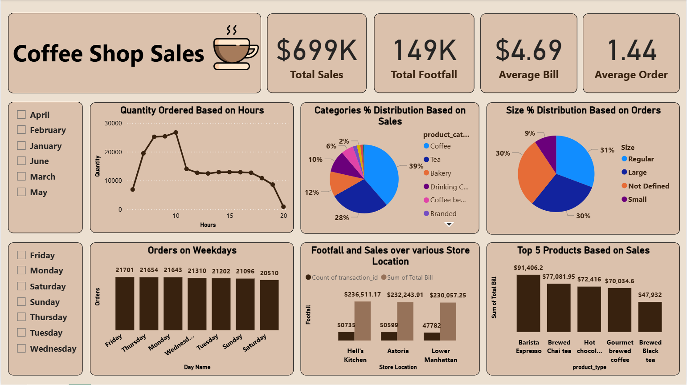

# Coffee-Shop-Sales-Excel-PowerBi
# ☕ Coffee Shop Sales Analysis - Dashboard & Insights

This repository contains a comprehensive data analysis project for a coffee shop chain with locations in **New York City**. The project includes a raw transaction dataset and a **Power BI Dashboard** (`.pbix`) designed to track sales performance, product trends, and store efficiency.

## 📊 Project Overview
This project presents a comprehensive analysis of sales performance for a New York City-based coffee shop chain. By leveraging a dataset of over 149,000 transactions, I have built an interactive Power BI Dashboard to help stakeholders monitor business health, optimize inventory, and identify growth opportunities across multiple locations.

## 📁 Files in Repository
- `Coffee Shop Sales.xlsx - Transactions.csv`: The primary dataset containing over 149,000 transaction records.
- `Coffee Shop Sales.pbix`: The interactive Power BI dashboard file.

## 📈 Key Insights (Jan - June 2023)
Based on the data analysis, here are the high-level performance metrics:

- **Total Revenue:** ~$698,812.33
- **Total Transactions:** 149,116
- **Top Performing Locations:**
  1. **Hell's Kitchen:** $236,511.17
  2. **Astoria:** $232,243.91
  3. **Lower Manhattan:** $230,057.25
- **Top Product Categories by Revenue:**
  - **Coffee:** $269,952.45
  - **Tea:** $196,405.95
  - **Bakery:** $82,315.64

## 🛠️ Data Dictionary
The dataset includes the following key columns:
| Column | Description |
| :--- | :--- |
| `transaction_id` | Unique identifier for each sale. |
| `transaction_date` | Date of the purchase (YYYY-MM-DD). |
| `transaction_qty` | Number of items purchased. |
| `store_location` | Specific store where the sale occurred. |
| `product_category` | High-level grouping (e.g., Coffee, Tea, Bakery). |
| `unit_price` | Price of a single unit of the product. |
| `total_sales` | Calculated field (`qty * unit_price`). |

## 🚀 How to Use
1. **Power BI Dashboard:** Download and open `Coffee Shop Sales.pbix` using **Power BI Desktop**. 
   - *Note:* You may need to refresh the data source path to point to the CSV file on your local machine.
2. **Data Exploration:** The CSV file can be opened in Excel, Python (Pandas), or SQL for further custom analysis.

## 💡 Visualizations Included
The Power BI report provides:
- **Sales Trends:** Daily and monthly revenue growth.
- **Product Analysis:** Identifying best-selling items and types.
- **Store Comparison:** Performance metrics across different NYC neighborhoods.
- **Hourly Traffic:** Understanding peak hours for better staffing.

## **Dashboard / Output**

*The SQL Views generated in this project serve as the live data source for the interactive dashboard, visualizing real-time trends in ride distance, ratings, and revenue.*
---
*Created as part of a Data Analytics portfolio.*
